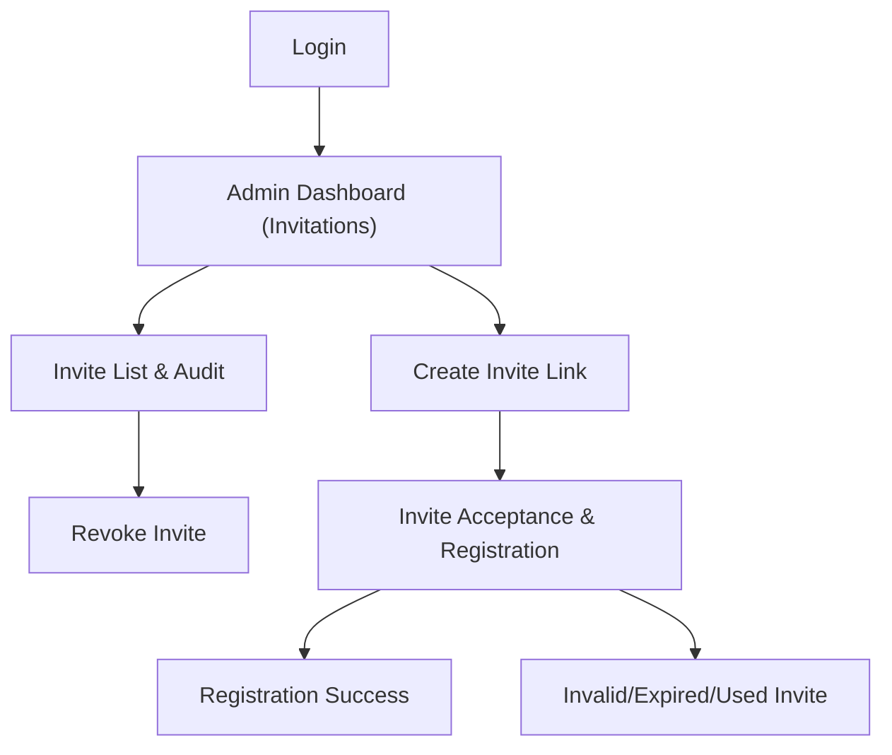

## 1. Product Overview
Single-use, signed invitation links allow School Admins to onboard Parents, Teachers, or General users securely.
Links expire (default 7 days), cannot be reused, are audited end-to-end, and are protected by rate limits.

## 2. Core Features

### 2.1 User Roles
| Role | Registration Method | Core Permissions |
|------|---------------------|------------------|
| School Admin | Existing admin account login | Generate/revoke invitation links; view status and audit trail |
| Invitee (Parent/Teacher/General) | Invite-only via signed link | Register account; complete onboarding tied to the invite type |

### 2.2 Feature Module
Our invitation-link requirements consist of the following main pages:
1. **Admin Dashboard (Invitations)**: create invitation links, list/search links, revoke links, view usage/audit.
2. **Invite Acceptance & Registration**: validate invite, show invite details, register account, confirm success/invalid.
3. **Login**: authenticate School Admin to access dashboard.

### 2.3 Page Details
| Page Name | Module Name | Feature description |
|-----------|-------------|---------------------|
| Admin Dashboard (Invitations) | Create invite link | Generate a signed, single-use link for one of: Parent / Teacher / General; set expiry (default 7 days); display copyable link |
| Admin Dashboard (Invitations) | Invite list & status | List invites with filters (type, status: active/expired/revoked/consumed); show created date, expiry date, creator, consumption status |
| Admin Dashboard (Invitations) | Revoke invite | Revoke an active invite to invalidate it immediately; record audit event |
| Admin Dashboard (Invitations) | Audit & rate limit visibility | Display audit timeline per invite (created/viewed/consumed/revoked/expired) and show rate-limit errors when thresholds are exceeded |
| Invite Acceptance & Registration | Invite validation | Validate signature, expiry, and single-use status; show clear states: valid, expired, revoked, already used, invalid |
| Invite Acceptance & Registration | Registration | Register user account and assign the invite’s role type; atomically mark invite as consumed to prevent reuse |
| Invite Acceptance & Registration | Confirmation | Show successful acceptance result and next-step link (e.g., go to login/home) |
| Login | Admin authentication | Log in School Admin to access dashboard; handle errors and logout |

## 3. Core Process
**School Admin Flow**
1. Log in and open Admin Dashboard → Invitations.
2. Choose invite type (Parent/Teacher/General), optionally change expiry (default 7 days), and generate.
3. Copy and share the link.
4. Monitor status; optionally revoke; review audit trail.

**Invitee Flow**
1. Open the invitation link.
2. System validates signature + expiry + single-use status.
3. If valid, complete registration.
4. System consumes invite atomically and confirms success.

