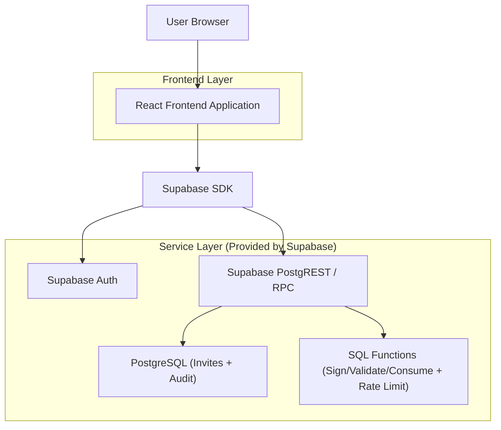
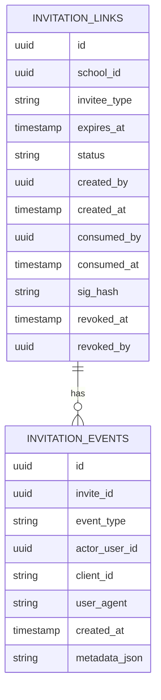

## 1.Architecture design


## 2.Technology Description
- Frontend: React@18 + TypeScript + vite + tailwindcss@3
- Backend: Supabase (Auth + Postgres + PostgREST RPC)

## 3.Route definitions
| Route | Purpose |
|-------|---------|
| /login | School Admin login |
| /admin/invitations | Create/revoke/list invitation links; view audit per invite |
| /invite/:inviteId | Public invite acceptance; registration; error states |

## 4.API definitions (If it includes backend services)
### 4.1 Shared Types (TypeScript)
```ts
type InviteeType = "parent" | "teacher" | "general";

type InviteStatus = "active" | "expired" | "revoked" | "consumed";

type InvitationLink = {
  id: string; // uuid
  school_id: string;
  invitee_type: InviteeType;
  expires_at: string; // ISO
  status: InviteStatus;
  created_by: string; // admin user id
  created_at: string;
  consumed_by?: string; // user id
  consumed_at?: string;
};

type InvitationEventType =
  | "created"
  | "viewed"
  | "consumed"
  | "revoked"
  | "expired"
  | "rate_limited"
  | "validation_failed";
```

### 4.2 Core RPC (PostgREST /rpc)
1) Create invite (admin-only)
- `POST /rest/v1/rpc/create_invitation_link`

Request params:
| Param Name | Param Type | isRequired | Description |
|---|---|---:|---|
| p_school_id | uuid | true | Target school |
| p_invitee_type | text | true | parent/teacher/general |
| p_expires_in_days | int | false | Defaults to 7 |

Response:
| Field | Type | Description |
|---|---|---|
| invite_id | uuid | Created invite id |
| signed_url | text | Full URL containing invite_id and signature |

2) Get invite metadata (public)
- `POST /rest/v1/rpc/get_invitation_link_metadata`

Request params:
| Param Name | Param Type | isRequired | Description |
|---|---|---:|---|
| p_invite_id | uuid | true | Invite id |
| p_sig | text | true | Signature from URL |
| p_client_id | text | false | Client fingerprint for rate limiting |

Response (minimal): invitee_type, status, expires_at

3) Consume invite (authenticated newly-registered user)
- `POST /rest/v1/rpc/consume_invitation_link`

Request params: p_invite_id, p_sig

Behavior:
- Validate signature + status + expiry
- Atomically mark as consumed (single-use enforcement)
- Write audit event
- Return success/failure code

## 6.Data model(if applicable)
### 6.1 Data model definition


### 6.2 Data Definition Language
Invitation Links (invitation_links)
```sql
CREATE TABLE invitation_links (
  id uuid PRIMARY KEY DEFAULT gen_random_uuid(),
  school_id uuid NOT NULL,
  invitee_type text NOT NULL CHECK (invitee_type IN ('parent','teacher','general')),
  expires_at timestamptz NOT NULL,
  status text NOT NULL DEFAULT 'active' CHECK (status IN ('active','expired','revoked','consumed')),
  created_by uuid NOT NULL,
  created_at timestamptz NOT NULL DEFAULT now(),
  consumed_by uuid NULL,
  consumed_at timestamptz NULL,
  revoked_at timestamptz NULL,
  revoked_by uuid NULL,
  sig_hash text NOT NULL
);

CREATE INDEX idx_invitation_links_school_status ON invitation_links(school_id, status);
CREATE INDEX idx_invitation_links_expires_at ON invitation_links(expires_at);

CREATE TABLE invitation_events (
  id uuid PRIMARY KEY DEFAULT gen_random_uuid(),
  invite_id uuid NOT NULL,
  event_type text NOT NULL,
  actor_user_id uuid NULL,
  client_id text NULL,
  user_agent text NULL,
  metadata_json jsonb NULL,
  created_at timestamptz NOT NULL DEFAULT now()
);

CREATE INDEX idx_invitation_events_invite_id ON invitation_events(invite_id);
CREATE INDEX idx_invitation_events_created_at ON invitation_events(created_at DESC);
```

Security & access notes (RLS-first)
- Enable RLS on both tables; allow School Admins to access only their school rows.
- Prefer RPC functions (`SECURITY DEFINER`) for: signing, validation, consumption, and rate-limit checks.
- Avoid exposing raw tokens/signatures; store only `sig_hash` (e.g., SHA-256 of signature).

Typical grants (adjust to your existing auth roles)
```sql
GRANT ALL PRIVILEGES ON invitation_links TO authenticated;
GRANT ALL PRIVILEGES ON invitation_events TO authenticated;
-- Public users should call RPC; do not grant direct table access to anon.
```

